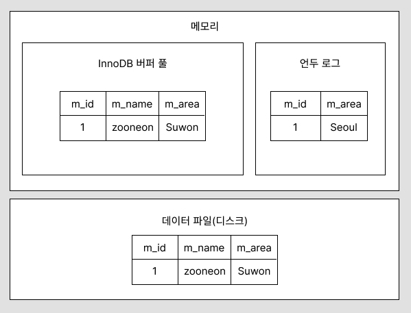

# 4.2 InnoDB 스토리지 엔진 아키텍처

## InnoDB 스토리지 엔진

- MySQL 스토리지 엔진 가운데 **가장 많이 사용됨**
- MySQL에서 사용할 수 있는 스토리지 엔진 중 거의 유일하게 레코드 기반의 잠금을 제공
    - 높은 동시성 처리가 가능하고 안정적이며 성능이 뛰어남

## 4.2.1 프라이머리 키에 의한 클러스터링

- InnoDB의 모든 테이블은 기본적으로 프라이머리 키를 기준으로 클러스터링되어 저장됨
    - 프라이머리 키 값의 순서대로 디스크에 저장
    - 모든 세컨더리 인덱스는 레코드의 주소 대신 프라이머리 키의 값을 논리적인 주소로 사용
- 프라이머리 키가 클러스터링 인덱스이기 때문에 프라이머리 키를 이용한 레인지 스캔을 빨리 처리 가능
- 쿼리의 실행 계획에서 프라이머리 키는 기본적으로 다른 보조 인덱스에 비해 비중이 높게 설정

## 4.2.2 외래 키 지원

- InnoDB 스토리지 엔진 레벨에서 지원하는 기능으로 `MyISAM`이나 `MEMORY` 테이블에서는 사용 불가능
- InnoDB에서 외래 키는 부모 테이블과 자식 테이블 모두 해당 칼럼에 인덱스 생성이 필요
- 변경 시에는 반드시 부모 테이블이나 자식 테이블에 데이터가 있는지 작업이 필요하므로 잠금이 여러 테이블로 전파되기 때문에 데드락 등을 주의해야 함
- `foreign_key_checks` 시스템 변수를 `OFF`로 설정하면 외래 키 관계에 대한 체크 작업을 일시적으로 멈출 수 있음
    - 외래 키 체크를 일시적으로 중지한 상태여도 데이터의 일관성을 꼭 맞춰야 함
    - `foreign_key_checks`가 비활성화되면 외래 키 관계의 부모 테이블에 대한 작업(`ON DELETE CASCADE`, `ON UPDATE CASCADE`)도 무시하게 됨
- `foreign_key_checks` 시스템 변수는 적용 범위를 `GLOBAL`과 `SESSION` 모두로 설정 가능
    - 반드시 현재 작업을 실행하는 세션에서만 외래 키 체크 기능을 멈추게 해야 함
    - `SESSION` 키워드를 명시하지 않으면 자동으로 현재 세션의 설정만 변경함
    
    ```sql
    SET foreign_key_checks=OFF;
    SET SESSION foreign_key_chekcs=OFF;
    ```
    
    - 작업이 완료되면 반드시 현재 세션을 종료하거나 현재 세션의 외래 키 체크를 다시 활성화해야 함

## 4.2.3 MVCC(Multi Version Concurrency Control)

- MVCC의 가장 큰 목적은 잠금을 사용하지 않는 일관된 읽기를 제공하는 데 있음
- InnoDB는 `언두 로그(Undo log)`를 이용해 이 기능을 구현
- 멀티 버전은 하나의 레코드에 대해 여러 개의 버전이 동시에 관리된다는 의미
- 격리 수준에 따라 반환하는 데이터(레코드 버전)이 다름

```sql
CREATE TABLE member (
	m_id INT NOT NULL,
	m_name VARCHAR(20) NOT NULL,
	m_area VARCHAR(100) NOT NULL,
	PRIMARY KEY (m_id),
	INDEX ix_area (m_area)
);

INSERT INTO member(m_id, m_name, m_area) VALUES (1, 'zooneon', 'Seoul');
COMMIT;

UPDATE member SET m_area='Suwon' WHERE m_id=1;
```

- 쿼리를 실행하면 대략 아래와 같은 상태가 됨



- 위와 같은 상황에서 격리 수준이 `READ_UNCOMMITTED`인 경우에는 InnoDB 버퍼 풀이 현재 가지고 있는 변경된 데이터를 읽어서 반환
- 만약 `READ_UNCOMMITED`보다 높은 수준의 격리 수준(`READ_COMMITTED`, `REPEATABLE_READ`, `SERIALIZABLE`)인 경우에는 아직 커밋되지 않았기 때문에 변경되기 이전의 내용을 보관하고 있는 언두 영역의 데이터를 반환
- 트랜잭션이 길어지면 언두에서 관리하는 예전 데이터가 삭제되지 못하고 오랫동안 관리되어야 하며, 언두 영역이 저장되는 시스템 테이블스페이스의 공간이 많이 늘어날 수 있음
- UPDATE문을 실행한 뒤 `COMMIT` 명령을 실행하면 InnoDB는 더 이상의 변경 작업 없이 지금의 상태를 영구적인 데이터로 만듦
- `ROLLBACK` 명령을 실행하면 언두 영역에 있는 백업된 데이터를 InnoDB 버퍼 풀로 다시 복구하고, 언두 영역의 내용을 삭제
- 커밋이 된 후 언두 영역을 필요로 하는 트랜잭션이 더 없을 때 언두 영역의 내용 삭제

## 4.2.4 잠금 없는 일관된 읽기(Non-Locking Consistent Read)

- InnoDB 스토리지 엔진은 MVCC 기술을 이용해 잠금을 걸지 않고 읽기 작업을 수행하기 때문에 다른 트랜잭션이 가지고 있는 잠금을 기다리지 않고, 읽기 작업이 가능
- 격리 수준이 `SERIALIZABLE`이 아닌 경우 INSERT와 연결되지 않은 순수한 SELECT 작업은 다른 트랜잭션의 변경 작업과 관계없이 항상 잠금을 대기하지 않고 바로 실행
- 이를 `잠금 없는 일관된 읽기`라고 표현하며, InnoDB에서는 변경되기 전의 데이터를 읽기 위해 언두 로그를 사용
- 트랜잭션이 오랜 시간 활성 상태일 경우 잠금 없는 일관된 읽기를 위해 언두 로그를 삭제하지 못하여 MySQL 서버가 느려지거나 문제가 발생할 수 있음
    - 트랜잭션이 시작됐다면 가능한 빨리 롤백이나 커밋을 통해 트랜잭션을 완료하는 것이 좋음

## 4.2.5 자동 데드락 감지

- InnoDB 스토리지 엔진은 내부적으로 잠금이 교착 상태에 빠지지 않았는지 체크하기 위해 잠금 대기 목록을 그래프 형태로 관리
- 데드락 감지 스레드가 주기적으로 잠금 대기 그래프를 검사해 교착 상태에 빠진 트랜잭션들을 찾아 하나를 강제 종료
- 이때 어느 트랜잭션을 먼저 강제 종료할 것인지를 판단하는 기준은 트랜잭션의 언두 로그 양이며, 언두 로그 레코드를 더 적게 가진 트랜잭션이 일반적으로 롤백의 대상이 됨
- 상위 레이어인 MySQL 엔진에서 관리되는 테이블 잠금(LOCK TABLES 명령으로 잠긴 테이블)은 볼 수가 없어 데드락 감지가 불확실할 수 있음
    - `innodb_table_locks` 시스템 변수를 활성화하여 테이블 레벨의 잠금까지 감지할 수 있음
    - 특별한 이유가 없다면 `innodb_table_locks` 시스템 변수를 활성화하는 것이 좋음
- 데드락 감지 스레드는 잠금 목록을 검사해야 하기 때문에 잠금 상태가 변경되지 않도록 잠금 목록이 저장된 리스트에 새로운 잠금을 걸고 데드락 스레드를 찾음
    - 동시 처리 스레드가 매우 많아지거나 각 트랜잭션이 가진 잠금 개수가 많아지면 데드락 감지 스레드가 느려짐
    - 데드락 감지 스레드가 느려지면 서비스 쿼리를 처리 중인 스레드는 더이상 작업을 진행하지 못하고 대기하게 됨
    - 동시 처리 스레드가 많은 경우 데드락 감지 스레드는 더 많은 CPU 자원을 소모할 수 있음
- 이런 문제점을 해결하기 위해 MySQL 서버는 `innodb_deadlock_detect` 시스템 변수를 제공
    - `innodb_deadlock_detect` 변수를 OFF로 설정하면 데드락 감지 스레드는 작동하지 않음
    - 하지만 데드락이 발생할 수 있음
    - `innodb_lock_wait_timeout` 시스템 변수를 초 단위로 설정하여 데드락 상황에서 일정 시간이 지나면 자동으로 요청이 실패하고 에러 메시지를 반환하도록 할 수 있음
    - `innodb_deadlock_detect`를 OFF로 설정해서 비활성화하는 경우라면 `innodb_lock_wait_timeout`을 기본값인 50초보다 훨씬 낮은 시간으로 변경해서 사용하는 것이 좋음

## 4.2.6 자동화된 장애 복구

- InnoDB에는 손실이나 장애로부터 데이터를 보호하기 위한 여러 매커니즘을 통해 MySQL 서버가 시작될 때 완료되지 못한 트랜잭션이나 디스크에 일부만 기록된 데이터 페이지 등에 대한 일련의 복구 작업을 자동으로 진행
- InnoDB 데이터 파일은 기본적으로 MySQL 서버가 시작될 때 항상 자동 복구를 수행
- 자동으로 복구될 수 없는 손상이 있다면 자동 복구를 멈추고 MySQL 서버는 종료되는데 이때는 `innodb_force_recovery` 시스템 변수를 설정해서 MySQL 서버를 시작해야 함
- `innodb_force_recovery` 변수는 MySQL 서버가 시작될 때 InnoDB 스토리지 엔진이 데이터 파일이나 로그 파일의 손상 여부 검사 과정을 선별적으로 진행할 수 있게 함
- `innodb_force_recovery` 값에 따른 장애 상황과 해결 방법
    - 1 (SRV_FORCE_IGNORE_CORRUPT)
        - InnoDB의 테이블스페이스의 데이터나 인덱스 페이지에서 손상된 부분이 발견돼도 무시하고 MySQL 서버를 시작
        - 에러 로그 파일에 `Database page corruption on disk or a failed` 메시지가 출력될 때는 대부분 이 경우에 해당
        - 이때는 mysqldump 프로그램이나 `SELECT INTO OUTFILE...` 명령을 이용해 덤프해서 데이터베이스를 다시 구축하는 것이 좋음
    - 2 (SRV_FORCE_NO_BACKGROUND)
        - 여러 백그라운드 스레드 가운데 메인 스레드를 시작하지 않고 MySQL 서버를 시작
        - InnoDB는 불필요한 언두 데이터를 메인 스레드로 주기적으로 삭제하는데, 이 과정에서 장애가 발생하면 이 모드로 복구
    - 3 (SRV_FORCE_NO_TRX_UNDO)
        - MySQL 서버는 다시 시작하면서 언두 영역의 데이터를 먼저 데이터 파일에 적용하고 리두 로그의 내용을 다시 덮어 써서 장애 시점의 데이터 상태를 만들어냄
        - 최종적으로 커밋되지 않은 트랜잭션은 롤백을 수행하지만 이 값으로 설정되면 커밋되지 않은 트랜잭션의 작업을 롤백하지 않음
        - 이때도 mysqldump를 이용해 데이터를 백업해서 다시 데이터베이스를 구축하는 것이 좋음
    - 4 (SRV_FORCE_NO_IBUF_MERGE)
        - InnoDB는 `INSERT`, `UPDATE`, `DELETE` 등의 데이터 변경으로 인한 인덱스 변경 작업을 상황에 따라 즉시 처리할 수도 있고 인서트 버퍼에 저장해두고 나중에 처리할 수 있음
        - MySQL을 종료해도 인서트 버퍼에 기록된 내용은 데이터 파일에 병합되지 않을 수 있는데, MySQL이 재시작되면서 인서트 버퍼의 손상을 감지하면 InnoDB는 에러를 발생시키고 MySQL 서버는 시작하지 않음
        - 이때 변수 값을 4로 설정하면 InnoDB 스토리지 엔진이 인서트 버퍼의 내용을 무시하고 강제로 MySQL이 시작됨
        - 인서트 버퍼는 실제 데이터와 관련된 부분이 아니라 인덱스에 관련된 부분이므로 테이블을 덤프한 후 다시 데이터베이스를 구축하면 데이터의 손실 없이 복구 가능
    - 5 (SRV_FORCE_NO_UNDO_LOG_SCAN)
        - InnoDB의 언두 로그를 사용할 수 없다면 InnoDB 엔진 에러로 MySQL 서버를 시작할 수 없음
        - 값을 5로 설정하면 InnoDB 엔진이 언두 로그를 모두 무시하고 MySQL을 시작할 수 있음
        - 하지만 이 모드로 복구되면 MySQL 서버가 종료되던 시점에 커밋되지 않았던 작업도 모두 커밋된 것처럼 처리되므로 실제로는 잘못된 데이터가 남을 수 있음
        - 이때도 mysqldump를 이용해 데이터를 백업하고 데이터베이스를 새로 구축
    - 6 (SRV_FORCE_NO_LOG_REDO)
        - InnoDB 스토리지 엔진의 리두 로그가 손상되면 MySQL 서버가 시작할 수 없음
        - 값을 6으로 설정하면 InnoDB 엔진은 리두 로그를 모두 무시한 채로 MySQL 서버가 시작됨
        - 커밋됐다 하더라도 리두 로그에만 기록되고 데이터 파일에 기록되지 않은 데이터는 모두 무시됨
        - 이때는 기존 InnoDB의 리두 로그는 모두 삭제 또는 백업하고 MySQL 서버를 시작하는 것이 좋음
        - mysqldump를 이용해 데이터를 모두 백업해서 MySQL 서버를 새로 구축하는 것이 좋음
- 위와 같이 진행했음에도 MySQL 서버가 시작되지 않으면 백업을 이용해 다시 구축하는 방법밖에 없음
- 백업이 있다면 마지막 백업으로 데이터베이스를 새로 구축하고, 바이너리 로그를 사용해 최대 장애 시점까지의 데이터를 복구할 수도 있음
    - 마지막 풀 백업 시점부터 장애 시점까지의 바이너리 로그가 있다면 InnoDB의 복구를 이용하는 것보다 풀 백업과 바이너리 로그를 복구하는 편이 데이터 손실이 적을 수 있음
    - 백업은 있지만 복제의 바이너리 로그가 없거나 손실됐다면 마지막 백업 시점까지만 복구할 수 있음

## 4.2.7 InnoDB 버퍼 풀

- InnoDB 스토리지 엔진에서 가장 핵심적인 부분으로, 디스크의 데이터 파일이나 인덱스 정보를 메모리에 캐시해 두는 공간
- 쓰기 작업을 지연시켜 일괄 작업으로 처리할 수 있게 해주는 버퍼 역할도 함
- 데이터를 변경하는 경우 레코드를 변경하기 때문에 랜덤한 디스크 작업을 발생시키지만 버퍼 풀이 변경된 데이터를 모아서 처리하면 랜덤한 디스크 작업의 횟수를 줄일 수 있음

### 4.2.7.1 버퍼 풀의 크기 설정

- 버퍼 풀의 크기를 설정할 때는 운영체제와 각 클라이언트 스레드가 사용할 메모리도 충분히 고려해서 설정해야 함
- `레코드 버퍼`는 각 클라이언트 세션에서 테이블의 레코드를 읽고 쓸 때 버퍼로 사용하는 공간을 말하는데, 커넥션이 많고 사용하는 테이블도 많다면 레코드 버퍼 용도로 사용되는 메모리 공간이 꽤 많이 필요해질 수 있음
- MySQL 서버가 사용하는 레코드 버퍼 공간은 별도로 설정할 수 없으며, 동적으로 해제되기도 하므로 정확히 필요한 메모리 공간의 크기를 계산할 수 없음
- 하지만 MySQL 5.7 버전부터는 InnoDB 버퍼 풀의 크기를 동적으로 조절할 수 있게 개선됨
- InnoDB 버퍼 풀의 크기를 적절히 작은 값으로 설정해서 조금씩 상황을 보며 증가시키는 방법이 최적임
    - 운영체제의 전체 메모리 공간이 8GB 미만이라면 50% 정도만 InnoDB 버퍼 풀로 설정하고 나머지 메모리 공간은 MySQL 서버와 운영체제, 다른 프로그램이 사용할 수 있는 공간으로 확보해주는 것이 좋음
    - 전체 메모리 공간이 그 이상이라면 InnoDB 버퍼 풀의 크기를 전체 메모리의 50%에서 시작해서 조금씩 올라가며 최적점을 찾는 것이 좋음
    - 운영체제의 전체 메모리 공간이 50GB 이상이라면, 대략 15GB에서 30GB 정도를 운영체제와 다른 프로그램을 위해 남겨두고 나머지를 InnoDB 버퍼 풀로 할당하는 것이 좋음
- InnoDB 버퍼 풀은 `innodb_buffer_pool_size` 시스템 변수로 크기를 설정할 수 있으며, 동적으로 버퍼 풀의 크기를 확장할 수 있음
- 버퍼 풀의 크기 변경은 크리티컬한 변경이므로 MySQL 서버가 한가한 시점에 진행하는 것이 좋음
    - 특히 버퍼 풀의 크기를 줄이는 작업은 서비스 영향도가 매우 크므로 가능하면 하지 않는 것이 좋음
- 버퍼 풀은 내부적으로 128MB 청크 단위로 쪼개어 관리되기 때문에 버퍼 풀의 크기를 줄이거나 늘릴 때는 128MB 단위로 처리됨
- InnoDb 버퍼 풀은 전통적으로 버퍼 풀 전체를 관리하는 잠금으로 인해 내부 잠금 경합을 많이 유발해왔는데, 이런 경합을 줄이기 위해 버퍼 풀을 여러 개로 쪼개어 관리할 수 있도록 개선됨
    - 개별 버퍼 풀 전체를 관리하는 잠금 자체도 경합이 분산되는 효과
- `innodb_buffer_pool_instances` 시스템 변수를 이용해 버퍼 풀을 여러 개로 분리해서 관리할 수 있는데, 각 버퍼 풀을 버퍼 풀 인스턴스라고 표현함
- 기본적으로 버퍼 풀 인스턴스의 개수는 8개로 초기화되지만 전체 버퍼 풀을 위한 메모리 크기가 1GB 미만이라면 인스턴스는 1개만 생성
- 할당 가능한 공간이 40GB 이하 수준이라면 기본값을 유지하고, 메모리가 크다면 버퍼 풀 인스턴스당 5GB 정도가 되게 인스턴스 개수를 설정하는 것이 좋음

### 4.2.7.2 버퍼 풀의 구조

- InnoDB 스토리지 엔진은 버퍼 풀이라는 거대한 메모리 공간을 페이지 크기의 조각으로 쪼개어 InnoDB 스토리지 엔진이 데이터를 필요로 할 때 해당 데이터 페이지를 읽어서 각 조각에 저장
- 버퍼 풀의 페이지 크기 조각을 관리하기 위해 크게 `LRU(Least Recently Used) 리스트`, `플러시(Flush) 리스트`, `프리(Free) 리스트`를 관리
- 프리 리스트는 InnoDB 버퍼 풀에서 실제 사용자가 데이터로 채워지지 않은 빈 페이지들의 목록이며, 사용자의 쿼리가 새롭게 디스크의 데이터 페이지를 읽어와야 하는 경우 사용
- LRU 리스트는 엄밀하게 LRU와 `MRU(Most Recently Used)` 리스트가 결합된 형태
- LRU 리스트를 관리하는 목적은 디스크로부터 한 번 읽어온 페이지를 최대한 오랫동안 InnoDB 버퍼 풀의 메모리에 유지해서 디스크 읽기를 최소화하는 것
- 한 번 읽힌 데이터 페이지가 자주 사용된다면 그 페이지는 InnoDB 버퍼 풀의 MRU 영역에서 계속 살아남게 되고, 거의 사용되지 않는다면 새롭게 읽히는 페이지들에 밀려 LRU의 끝으로 밀려나 결국 InnoDB 버퍼 풀에서 제거
- 플러시 리스트는 디스크로 동기화되지 않은 데이터를 가진 데이터 페이지(더티 페이지)의 변경 시점 기준의 페이지 목록을 관리
- 데이터 변경이 가해진 데이터 페이지는 플러시 리스트에서 관리되고 특정 시점이 되면 디스크로 기록되어야 함
- 데이터가 변경되면 InnoDB는 변경 내용을 리두 로그에 기록하고 버퍼 풀의 데이터 페이지에도 변경 내용을 반영하기 때문에 리두 로그의 각 엔트리는 특정 데이터 페이지와 연결됨
- InnoDB 스토리지 엔진은 체크포인트를 발생시켜 디스크의 리두 로그와 데이터 페이지의 상태를 동기화하는데, 체크포인트는 MySQL 서버가 시작될 때 InnoDB 스토리지 엔진이 리두 로그의 어느 부분부터 복구를 실행해야 할지 판단하는 기준점을 만드는 역할을 함

### 4.2.7.3 버퍼 풀과 리두 로그

- InnoDB의 버퍼 풀과 리두 로그는 매우 밀접한 관계를 맺고 있음
- InnoDB의 버퍼 풀은 서버의 메모리가 허용하는 만큼 크게 설정할 수록 쿼리의 성능이 빨라짐
- InnoDB 버퍼 풀은 데이터베이스 서버의 성능 향상을 위해 데이터 캐시와 쓰기 버퍼링이라는 용도가 있는데, 버퍼 풀의 메모리 공간만 늘리는 것은 데이터 캐시 기능만 향상시킴
- InnoDB 버퍼 풀의 쓰기 버퍼링 기능까지 향상시키기 위해선 InnoDB 버퍼 풀과 리두 로그와의 관계를 이해해야 함
- InnoDB의 버퍼 풀은 디스크에서 읽은 상태로 클린 페이지와 더티 페이지를 갖고 있음
- 데이터 변경이 계속 발생하면 리두 로그 파일에 기록됐던 로그 엔트리는 새로운 로그 엔트리로 덮어 쓰여지는데, 이를 위해 리두 로그는 1개 이상의 고정 크기 파일을 연결하여 순환 고리처럼 사용
- InnoDB 스토리지 엔진은 전체 리두 로그 파일에서 재사용 가능한 공간과 불가능한 공간을 구분해서 관리해야 하는데, 재사용 불가능한 공간을 `활성 리두 로그(Active Redo Log)`라고 함
- 리두 로그 파일은 기록될 때마다 로그 포지션은 증가된 값을 갖게 되는데, 이를 `LSN(Log Sequence Number)`라고 함
- InnoDB 스토리지 엔진은 주기적으로 체크포인트 이벤트를 발생시켜 리두 로그와 버퍼 풀의 더티 페이지를 디스크로 동기화하는데, 가장 최근 체크포인트 지점의 LSN이 활성 리두 로그 공간의 시작점이 됨
    - 하지만 활성 리두 공간의 마지막은 계속해서 증가하기 때문에 체크포인트와 무관
- 가장 최근 체크포인트의 LSN과 마지막 리두 로그 엔트리의 LSN의 차이를 `체크포인트 에이지(Checkpoint Age)`라고 함
- 체크 포인트 에이지는 활성 리두 로그 공간의 크기

### 4.2.7.4 버퍼 풀 플러시 (Buffer Pool Flush)

- InnoDB 스토리지 엔진은 버퍼 풀에서 아직 디스크로 기록되지 않은 더티 페이지들을 성능상의 악영향 없이 디스크에 동기화하기 위해 2개의 플러시 기능을 백그라운드로 실행
    - 플러시 리스트 플러시
    - LRU 리스트 플러시

**4.2.7.4.1 플러시 리스트 플러시**

- InnoDB 스토리지 엔진은 주기적으로 플러시 리스트 플러시 함수를 호출해서 플러시 리스트에서 오래전에 변경된 데이터 페이지 순서대로 디스크에 동기화하는 작업을 수행함
- 얼마나 많은 더티 페이지를 한 번에 디스크로 기록하느냐에 따라 사용자의 쿼리 처리가 악영향을 받지 않으면서 부드럽게 처리됨
- 이를 위해 다음과 같은 시스템 변수들을 제공
    - `innodb_page_cleaners`
        - InnoDB 스토리지 엔진에서 더티 페이지를 디스크로 동기화하는 스레드를 `클리너 스레드(Cleaner Thread)`라고 하는데, `innodb_page_cleaners` 시스템 변수는 클리너 스레드의 개수를 조정할 수 있게 해줌
        - 스토리지 엔진에는 여러 개의 InnoDB 버퍼 풀 인스턴스를 동시에 사용할 수 있는데, `innodb_page_cleaners` 설정값이 버퍼 풀 인스턴스 개수보다 많은 경우에는 `innodb_buffer_pool_instances` 설정값으로 자동 변경
        - `innodb_page_cleaners` 설정값은 `innodb_buffer_pool_instances` 설정값과 동일한 값으로 설정하는 것이 좋음
    - `innodb_max_dirty_pages_pct_lwm, innodb_max_dirty_pages_pct`
        - InnoDB 버퍼 풀은 한계가 있는데 `innodb_max_dirty_pages_pct` 변수를 통해 더티 페이지의 비율을 조정할 수 있음
        - 일반적으로 버퍼 풀은 더티 페이지를 많이 가지고 있을수록 디스크 쓰기 작업을 버퍼링 함으로써 여러 번의 디스크 쓰기를 한 번으로 줄이는 효과를 극대화할 수 있기 때문에 기본값을 유지하는 것이 좋음
        - `innodb_io_capacity` 변수에 설정된 값을 기준으로 더티 페이지 쓰기를 실행하는데, 더티 페이지의 비율이 90%를 넘어가면 InnoDB 스토리지 엔진은 디스크로 기록해야 한다고 판단하여 디스크 쓰기가 폭증하는 현상이 발생함
        - `innodb_max_dirty_pages_pct_lwm`이라는 시스템 설정 변수를 이용해 일정 수준 이상의 더티 페이지가 발생하면 조금씩 더티 페이지를 디스크로 기록하게 할 수 있음
        - 기본값은 10% 수준인데, 만약 더티 페이지의 비율이 얼마 되지 않는 상태에서 디스크 쓰기가 많이 발생하고 더티 페이지의 비율이 너무 낮은 상태로 계속 머물러 있다면 조금 더 높은 값으로 조정하여 디스크 쓰기 횟수를 줄일 수 있음
    - `innodb_io_capacity, innodb_io_capacity_max`
        - `innodb_io_capacity`와 `innodb_io_capacity_max` 시스템 변수는 각 데이터베이스 서버에서 어느 정도의 디스크 읽고 쓰기가 가능한지를 설정하는 값
            - `innodb_io_capacity`는 일반적인 상황에서 디스크가 적절히 처리할 수 있는 수준의 값을 설정
            - `innodb_io_capacity_max`는 디스크가 최대의 성능을 발휘할 때 어느 정도의 디스크 읽고 쓰기가 가능한지를 설정
    - `innodb_flush_neighbors`
        - 더티 페이지를 기록할 때 디스크에 근접한 페이지 중 더티 페이지가 있다면 함께 묶어서 기록하게 해주는 기능을 활성화할지 결정
        - 데이터 저장을 HDD에 하고 있다면 값을 1 또는 2로 설정하여 활성화하는 것이 좋고, SSD에 하고 있다면 기본값인 비활성 모드로 유지하는 것이 좋음
    - `innodb_adaptive_flushing, innodb_adaptive_flushing_lwm`
        - 기본값은 ON
        - 어댑티브 플러시 알고리즘은 `innodb_io_capacity`, `innodb_io_capacity_max` 값에 의존하지 않고 리두 로그의 증가 속도를 분석해서 적절한 수준의 더티 페이지가 버퍼 풀에 유지될 수 있도록 디스크 쓰기를 실행
        - `innodb_adaptive_flushing_lwm` 시스템 변수의 기본값은 10%인데, 전체 리두 로그 공간에서 활성 리두 로그의 공간이 10% 미만이면 어댑티브 플러시가 작동하지 않다가 10%를 넘어서면 알고리즘이 작동

**4.2.7.4.2 LRU 리스트 플러시**

- InnoDB 스토리지 엔진은 LRU 리스트에서 사용 빈도가 낮은 데이터 페이지들을 제거해서 새로운 페이지들을 읽어올 공간을 만들어야 하는데, 이를 위해 LRU 리스트 플러시 함수가 사용됨
- InnoDB 스토리지 엔진은 LRU 리스트의 끝부분부터 시작해서 최대 `innodb_lru_scan_depth` 시스템 변수에 설정된 개수만큼 페이지들을 스캔
- InnoDB 엔진은 스캔하면서 더티 페이지는 디스크에 동기화하며, 클린 페이지는 즉시 프리 리스트로 페이지를 옮김
- InnoDB 버퍼 풀 인스턴스별로 최대 `innodb_lru_scan_depth` 개수만큼 스캔하기 때문에 실질적으로 LRU 리스트 스캔은 `innodb_buffer_pool_instances * innodb_lru_scan_depth` 만큼 수행

### 4.2.7.5 버퍼 풀 상태 백업 및 복구

- InnoDB 서버의 버퍼 풀은 쿼리의 성능에 매우 밀접하게 연결되어 있음
- 디스크의 데이터가 버퍼 풀에 적재돼 있는 상태를 `워밍업(Warming Up)`이라고 표현하는데, 버퍼 풀이 잘 워밍업된 상태에서는 그렇지 않은 경우보다 몇십 배의 쿼리 처리 속도를 보여줌
- MySQL 5.5 버전에서는 점검을 위해 서버를 셧다운했다가 다시 시작하는 경우 강제 워밍업을 위해 주요 테이블과 인덱스에 대해 풀 스캔을 실행하였음
- 하지만 MySQL 5.6 버전부터는 버퍼 풀 덤프 및 적재 기능이 도입됨
- MySQL 서버를 재시작해야 하는 경우 MySQL 서버를 셧다운하기 전에 `innodb_buffer_pool_dump_now` 시스템 변수를 이용해 현재 InnoDB 버퍼 풀의 상태를 백업할 수 있음
- MySQL 서버를 다시 시작하면 `innodb_buffer_pool_load_now` 시스템 변수를 이용해 백업된 버퍼 풀의 상태를 다시 복구할 수 있음

```sql
SET GLOBAL innodb_buffer_pool_dump_now=ON;

SET GLOBAL innodb_buffer_pool_load_now=ON;
```

- InnoDB 버퍼 풀의 백업은 데이터 디렉토리에 `ib_buffer_pool`이라는 이름의 파일로 생성되는데, 버퍼 풀의 LRU 리스트에서 적재된 데이터 페이지의 메타 정보만 가져와서 저장하기 때문에 파일의 크기가 작음
- 따라서 버퍼 풀의 백업은 빨리 완료되지만 다시 버퍼 풀로 복구하는 과정은 InnoDB 버퍼 풀의 크기에 따라 상당한 시간이 걸릴 수도 있음(각 테이블의 데이터 페이지를 다시 디스크에서 읽어와야 하기 때문에)
- InnoDB 스토리지 엔진은 버퍼 풀을 다시 복구하는 과정이 어느 정도 진행됐는지 확인할 수 있도록 상태값을 제공

```sql
SHOW STATUS LIKE 'Innodb_buffer_pool_dump_status'\G
```

- 버퍼 풀 적재 작업에 너무 오랜 시간이 걸려 멈추고자 한다면 `innodb_buffer_pool_load_abort`  시스템 변수를 이용하면 됨
- 버퍼 풀을 다시 복구하는 작업은 상당히 많은 디스크 읽기를 필요로 하기 때문에 도중에 급히 서비스를 시작해야 한다면 버퍼 풀 복구를 멈추는 것이 좋음

```sql
SET GLOBAL innodb_buffer_pool_load_abort=ON;
```

- InnoDb 스토리지 엔진은 MySQL 서버가 셧다운되기 직전에 버퍼 풀의 백업을 실행하고, MySQL 서버가 시작되면 자동으로 백업된 버퍼 풀의 상태를 복구할 수 있는 기능을 제공
- 자동화하기 위해선 `innodb_buffer_pool_dump_at_shutdown`과 `innodb_buffer_pool_load_at_startup` 설정을 MySQL 서버의 설정 파일에 넣어두면 됨

### 4.2.7.6 버퍼 풀의 적재 내용 확인

- MySQL 5.6 버전부터 MySQL 서버의 `information_schema` 데이터베이스의 `innodb_buffer_page` 테이블을 이용해 InnoDB 버퍼 풀의 메모리에 어떤 테이블의 페이지들이 적재돼 있는지 확인할 수 있었음
- 하지만 버퍼 풀이 큰 경우에는 이 조회가 상당히 큰 부하를 일으키면서 서비스 쿼리가 느려지는 문제가 있었음
- MySQL 8.0 버전에서는 이런 문제점을 해결하기 위해 `information_schema` 데이터베이스에 `innodb_cached_indexes` 테이블이 새로 추가됨
- 이 테이블을 이용하면 테이블의 인덱스별로 데이터 페이지가 얼마나 InnoDb 버퍼 풀에 적재돼 있는지 확인할 수 있음

```sql
SELECT
	it.name table_name,
	ii.name index_name,
	ici.n_cached_pages n_cached_pages
FROM information_schema.innodb_tables it
	INNER JOIN information_schema.innodb_indexes ii ON ii.table_id = it.table_id
	INNER JOIN information_schema.innodb_cached_indexes ici ON ici.index_id = ii.index_id
WHERE it.name='TABLE NAME' 
```

- 아직 MySQL 서버는 개별 인덱스별로 전체 페이지 개수가 몇 개인지는 사용자에게 알려주지 않기 때문에 `information_schema` 데이터베이스의 테이블을 이용해도 테이블의 인덱스별로 페이지가 InnoDB 버퍼 풀에 적재된 비율은 확인할 수가 없음

## 4.2.8 Double Write Buffer

- InnoDB 스토리지 엔진의 리두 로그는 리두 로그 공간의 낭비를 막기 위해 페이지의 변경된 내용만 기록
- InnoDB 스토리지 엔진에서 더티 페이지를 디스크 파일로 플러시할 때 일부만 기록되는 문제가 발생하면 그 페이지의 내용은 복구할 수 없을 수도 있음
- 페이지가 일부만 기록되는 현상을 `파셜 페이지(Partial-page)` 또는 `톤 페이지(Ton-page)`라고 하는데, 이런 현상은 하드웨어의 오작동이나 시스템의 비정상 종료 등으로 발생할 수 있음
- InnoDB 스토리지 엔진에서는 이 문제를 막기 위해 `Double-Write` 기법을 이용
    - 실제 데이터 파일에 변경 내용을 기록하기 전에 더티 페이지를 우선 묶어 한 번의 디스크 쓰기로 시스템 테이블스페이스의 `DoubleWrite 버퍼`에 기록
    - 각 더티 페이지를 파일의 적당한 위치에 하나씩 랜덤으로 쓰기 실행
- DoubleWrite 버퍼의 내용은 실제 데이터 파일의 쓰기가 중간에 실패할 때만 원래의 목적으로 사용됨
    - 실제 데이터 파일에 더티 페이지가 정상적으로 기록되면 더이상 필요가 없어짐
- DoubleWrite 기능을 사용할지 여부는 `innodb_doublewrite` 시스템 변수로 제어 가능
- 데이터의 안정성을 위해 자주 사용되는데, HDD 같은 저장 시스템에서는 한 번의 순차 디스크 쓰기를 하는 것이기 때문에 부담이 되지 않지만 SSD처럼 랜덤 IO나 순차 IO의 비용이 비슷한 저장 시스템에서는 상당히 부담됨
- 하지만 데이터의 무결성이 매우 중요한 서비스에서는 DoubleWrite의 활성화를 고려하는 것이 좋음

## 4.2.9 언두 로그

> InnoDB 스토리지 엔진은 트랜잭션과 격리 수준을 보장하기 위해 DML(INSERT, UPDATE, DELETE)로 변경되기 이전 버전의 데이터를 별도로 백업하는데 이 백업된 데이터를 언두 로그(Undo Log)라고 한다.

- `트랜잭션 보장`: 트랜잭션이 롤백되면 트랜잭션 도중 변경된 데이터를 변경 전 데이터로 복구해야 하는데, 이때 언두 로그에 백업해둔 이전 버전의 데이터를 이용해 복구
- `격리 수준 보장`: 특정 커넥션에서 데이터를 변경하는 도중에 다른 커넥션에서 데이터를 조회하면 트랜잭션 격리 수준에 맞게 변경 중인 레코드를 읽지 않고 언두 로그에 백업해둔 데이터를 읽어서 반환하기도 함

### 4.2.9.1 언두 로그 레코드 모니터링

#### 언두 로그 데이터 저장 방식

```sql
UPDATE member SET name='홍길동' WHERE member_id=1;
```

- 위 문장이 실행되면 트랜잭션을 커밋하지 않아도 실제 데이터 파일(데이터/인덱스 버퍼) 내용은 '홍길동'으로 변경
- 변경되기 전의 값이 '벽계수'였다면, 언두 영역에는 '벽계수'라는 값(변경되기 전의 값) 백업
- 커밋하면 현재 상태 유지
- 롤백하면 언두 영역의 백업된 데이터를 다시 데이터 파일로 복구

#### 대용량의 데이터를 처리하는 트랜잭션으로 인한 언두 로그 증가

1. 1억 건의 레코드가 저장된 100GB 크기의 테이블을 DELETE로 삭제
2. MySQL 서버는 이 테이블에서 레코드를 한 건 삭제하고 언두 로그에 삭제되기 전 값을 저장
3. 이렇게 1억 건의 레코드가 테이블에서는 삭제되지만 언두 로그로 복사 -> 테이블 크기 만큼 언두 로그의 공간 사용량이 늘어남

#### 장시간 유지되는 트랜잭션으로 인한 언두 로그 증가

A: `BEGIN`-`SELECT`--------------------------------------->  
B: ..........`BEGIN`-`UPDATE`-`COMMIT`  
C: ......................`BEGIN`-`DELETE`-`COMMIT`

- 트랜잭션이 완료됐다고 해서 해당 트랜잭션이 생성한 언두 로그를 즉시 삭제할 수 있는 것은 아님
- 위 예시와 같은 경우 B, C 트랜잭션은 완료됐지만 가장 먼저 시작된 트랜잭션 A는 아직 완료되지 않은 상태 -> B, C 트랜잭션 완료 여부와 관계없이 B, C 트랜잭션이 만들어낸 언두로그 삭제되지 않음

#### MySQL 5.7, 8.0 이후 언두 로그 사용공간

MySQL 5.5 버전까지는 언두 로그의 사용 공간이 한 번 늘어나면 서버를 새로 구축하지 않는 한 줄일 수가 없었음.  
5.7, 8.0으로 업그레이드되면서 언두 로그 공간의 문제점은 완전히 해결.

#### 언두 로그 레코드 건수 조회

```sql
-- MySQL 서버의 모든 버전에서 사용 가능한 명령
SHOW ENGINE INNODB STATUS \G;

-- MySQL 8.0 버전에서 사용 가능한 명령
SELECT count
FROM information_schema.innodb_metrics
WHERE SUBSYSTEM='transaction' AND NAME='trx_rseg_history_len';
```

- MySQL 서버에서 트랜잭션이 장시간 유지되는 것은 성능상 좋지 않으므로 언두 로그 레코드가 얼마나 되는지 항상 모니터링 하는 것이 좋음
- MySQL 서버별로 이 값은 차이를 보이는데, 서버별로 안정적인 시점의 언두 로그 레코드 건수를 확인해 이를 기준으로 언두 로그의 급증 여부를 모니터링

### 4.2.9.2 언두 테이블스페이스 관리

> `언두 테이블스페이스(Undo Tablespace)`: 언두 로그가 저장되는 공간

- `언두 테이블스페이스`는 1 ~ 128 개의 `롤백 세그먼트`를 가짐
- `롤백 세그먼트`는 1개 이상의 `언두 슬롯(Undo Slot)`을 가짐
- 하나의 `롤백 세그먼트`는 InnoDB의 페이지 크기를 16바이트로 나눈 값의 개수 만큼의 `언두 슬롯`을 가짐
- 하나의 트랜잭션이 필요로 하는 언두 슬롯의 개수는 트랜잭션이 실행하는 INSERT, UPDATE, DELETE 문장의 특성에 따라 최대 4개 까지 사용
  - 일반적으로는 트랜잭션이 임시 테이블을 사용하지 않으므로 하나의 트랜잭션은 대략 2개 정도의 언두 슬롯을 필요로 한다고 가정하면 됨
- 최대 동시 트랜잭션 수 = (InnoDB 페이지 크기) / 16 \* (롤백 세그먼트 개수) \* 언두 테이블 스페이스 개수
  - 131072 (= 16 \* 1024 / 16 \* 128 \* 2 / 2)
  - 가장 일반 적인 설정인 16KB InnoDB에서 기본설정 (innodb_undo_tablespaces=2, innodb_rollback_segments=128) 을 사용할 때
  - 일반적이 서비스에서 이 정도까지 동시 트랜잭션이 필요하진 않겠지만 기본값으로 해서 크게 문제될 건 없으므로 가능하면 기본값 유지
- 언두 로그 공간이 남는 것은 크게 문제되지 않지만 언두 로그 슬롯이 부족한 경우에는 트랜잭션을 시작할 수 없는 심각한 문제가 발생
- 언두 로그 관련 시스템 변수를 변경해야 한다면 적절히 동시 트랜잭션 개수에 맞게 언두 테이블스페이스와 롤백 세그먼트의 개수를 설정
- MySQL 8.0 이전까지는 한 번 생성된 언두 로그는 변경이 허용되지 않고 정적으로 사용됐지만 8.0 부터는 새로운 언두 테이블스페이스를 동적으로 추가하고 삭제할 수 있게 됨

#### Undo tablespace truncate

> 언두 테이블스페이스 공간을 필요한 만큼만 남기고 불필요하거나 과도하게 할당된 공간을 운영체제로 반납하는 것.  
> MySQL 8.0 부터 지원.

- `자동모드`
  - 트랜잭션이 커밋되면 더이상 언두 로그에 복사된 이전 값은 불필요
  - `Undo Purge`: InnoDB 스토리지 엔진의 퍼지 스레드(Purge Thread)는 주기적으로 깨어나서 언두 로그 공간에서 불필요해진 언두 로그를 삭제하는 작업 실행
  - `innodb_undo_log_truncate` 시스템 변수가 ON으로 설정되면, 퍼지 스레드는 주기적으로 언두 로그 파일에서 사용되지 않는 공간을 잘라내고 운영체제로 반납
  - 언두 로그 파일을 잘라내는 작업을 조졀하려면 `innodb_purge_rseg_truncate_frequency` 시스템 변수의 값을 조정
- `수동모드`
  - `innodb_undo_log_truncate` 시스템 변수가 OFF로 설정되어 언두 로그 파일의 잘라내기가 자동으로 실행되지 않거나 자동 모드로 언두 테이블스페이스의 공간 반납이 부진한 경우
  - 언두 테이블스페이스를 비활성화해서 언두 테이블 스페이스가 더이상 사용되지 않도록 설정하면 퍼지 스레드는 비활성 상태의 언두테이블스페이스를 찾아서 불필요한 공간을 잘라내고 운영체제로 해당 공간을 반납
  - 반납이 완료되면 언두 테이블스페이스를 다시 활성화
  - 언두 테이블스페이스가 최소 3개 이상이어야 작동

```sql
-- 언두 테이블스페이스 비활성화
ALTER UNDO TABLESPACE tablespace_name SET INACTIVE;

-- 퍼지 스레드에 의해 언두 테이블스페이스 공간이 반납되면 다시 활성화
ALTER UNDO TABLESPACE tablespace_name SET ACTIVE;
```

## 4.2.10 체인지 버퍼

> 변경해야 할 인덱스 페이지가 버퍼 풀에 없고, 디스크로부터 읽어와서 업데이트해야 한다면 이를 즉시 실행하지 않고 임시 공간에 저장해두고 바로 사용자에게 결과를 반환하는데 이때 사용하는 임시 메모리 공간

- 결과를 전달하기 전에 반드시 중복 여부를 체크해야 하는 유니크 인덱스는 사용할 수 없음
- `체인지 버퍼 머지 스레드`: 체인지 버퍼에 임시로 저장된 인덱스 레코드 조각을 병합
- `innodb_change_buffering`: 작업의 종류별로 체인지 버퍼를 활성화하거나 체인지 버퍼가 비효율적일 때는 비활성화
  - `all`: 모든 인덱스 관련 작업(inserts + deletes + purges)을 버퍼링
  - `none`: 버퍼링 안함
  - `inserts`: 인덱스에 새로운 아이템을 추가하는 작업만 버퍼링
  - `deletes`: 인덱스에서 기존 아이템을 삭제하는 작업(삭제됐다는 마킹 작업)만 버퍼링
  - `changes`: 인덱스에 추가하고 삭제하는 작업만(inserts + deletes) 버퍼링
  - `purges`: 인덱스 아이템을 영구적으로 삭제하는 작업만 버퍼링(백그라운드 작업)
- `innodb_change_buffer_max_size`: 체인지 버퍼 사이즈 조절

```sql
-- 체인지 버퍼가 사용 중인 메모리 공간의 크기
SELECT EVENT_NAME, CURRENT_NUMBER_OF_BYTES_USED
FROM performance_schema.memory_summary_global_by_event_name
WHERE EVENT_NAME='memory/innodb/ibuf0ibuf';

-- 체인지 버퍼 관련 오퍼레이션 처리 횟수
SHOW ENGINE INNODB STATUS \G
```

## 4.2.11 리두 로그 및 로그 버퍼

> 서버가 비정상적으로 종료됐을 때 데이터 파일에 기록되지 못한 데이터를 잃지 않게 해주는 안전장치

- 대부분 데이터베이스 서버는 데이터 변경 내용을 로그로 먼저 기록
- 대부분 DBMS에서 데이터 파일은 쓰기보다 읽기 성능을 고려한 자료구조를 가지기 때문에 파일 쓰기는 디스크의 랜덤 액세스가 필요 -> 변경된 데이터를 데이터 파일에 기록하려면 상대적으로 큰 비용 필요
- 성능 저하를 막기 위해 데이터베이스 서버는 쓰기 비용이 낮은 자료구조를 가진 리두 로그를 가짐
- 비정상 종료가 발생하면 리두 로그의 내용을 이용해 데이터 파일을 다시 서버가 종료되기 직전의 상태로 복구
- 데이터 파일뿐만 아니라 리두 로그를 버퍼링할 수 있는 InnoDB  버퍼 풀이나 리두 로그를 버퍼링할 수 있는 로그 버퍼와 같은 자료구조 가짐

### MySQL 서버가 비정상 종료되는 경우

1. 커밋됐지만 데이터 파일에 기록되지 않은 경우
   - 리두 로그에 저장된 데이터를 데이터 파일에 다시 복사하기만 하면 됨
2. 롤백됐지만 데이터 파일에 이미 기록된 데이터
   - 리두 로그로는 해결 불가능
   - 변경되기 전 데이터를 가진 언두 로그의 내용을 가져와 데이터 파일에 복사
   - 변경이 커밋됐는지, 롤백됐는지, 트랜잭션의 실행 중간 상태였는지를 확인하기 위해 리두로그 필요

### `innodb_flush_log_at_trx_commit`

> InnoDB 스토리지 엔진에서 리두 로그를 어느 주기로 디스크에 동기화 할지를 결정

|`innodb_flush_log_at_trx_commit`||
|---|---|
|0|1초에 한 번씩 리두 로그를 디스크로 기록(write)하고 동기화(sync)를 실행|
|1|매번 트랜잭션이 커밋될 때마다 디스크로 기록되고 동기화까지 수행|
|2|매번 트랜잭션이 커밋될 때마다 디스크로 기록(write)은 되지만 실질적인 동기화(sync)는 1초에 한 번씩 실행|

- `innodb_flush_log_at_timeout (=1)`: 디스크 동기화 시간 간격 조정. 일반적으로는 기본값 사용.
- `innodb_log_file_size`: 리두 로그 파일의 크기 결정
- `innodb_log_files_in_group`: 리두 로그 파일의 개수를 결정
- 전체 리두 로그 파일의 크기 = `innodb_log_file_size` \* `innodb_log_files_in_group`

### 4.2.11.1 리두 로그 아카이빙

> 데이터 변경이 많아서 리두 로그가 덮어쓰인다고 하더라도 백업이 실패하지 않도록 해주는 기능

```sh
mkdir /var/log/mysql_redo_archive
cd /var/log/mysql_redo_archive
mkdir 20200722
chmod 700 20200722
```

```sql
-- 백업 툴이 리두 로그 아카이빙을 사용하려면 먼저 MySQL 서버에서 아카이빙된 리두 로그가 저장될 디렉터리 설정 해야함
SET GLOBAL innodb_redo_log_archive_dirs='backup:/var/log/mysql_redo_archive';

-- 리두 로그 아카이빙 시작
DO innodb_redo_log_archive_start('backup', '20200722');

-- 리두 로그 아카이빙 종료
DO innodb_redo_log_archive_stop();
```

### 4.2.11.2 리두 로그 활성화 및 비활성화

데이터를 복구하거나 대용량 데이터를 한번에 적재하는 경우 리두 로그를 비활성화해서 데이터의 적재 시간을 단축시킬 수 있음

```sql
-- 리두 로그 비활성화
ALTER INSTANCE DISABLE INNODB REDO_LOG;

-- 리두 로그를 비활성화한 후 대용량 데이터 적재를 실행
LOAD DATA...

-- 리두 로그 활성화
ALTER INSTANCE ENABLE INNODB REDO_LOG;

-- 리두 로그 활성화 여부 확인
SHOW GLOBAL STATUS LIKE 'Innodb_redo_log_enabled';
```

리두 로그를 비활성화하고 작업을 했다면 작업 완료 후 리두 로그를 반드시 활성화

## 4.2.12 어댑티브 해시 인덱스

> 사용자가 수동으로 생성하는 인덱스가 아니라 InnoDB 스토리지 엔진에서 사용자가 자주 요청하는 데이터에 대해 자동으로 생성하는 인덱스이며, `innodb_adaptive_hash_index` 를 통해서 활성화/비활성화 할 수 있다.

### 성능 향상에 도움이 되는 경우

- 디스크의 데이터가 InnoDB 버퍼 풀 크기와 비슷한 경우(디스크 읽기가 많지 않은 경우)
- 동등 조건 검색(동등 비교와 IN 연산자)이 많은 경우
- 쿼리가 데이터 중에서 일부 데이터에만 집중되는 경우

### 성능 향상에 도움이 되지 않는 경우

- 디스크 읽기가 많은 경우
- 특정 패턴의 쿼리가 많은 경우(조인이나 LIKE 패턴 검색)
- 매우 큰 데이터를 가진 테이블의 레코드를 폭넓게 읽는 경우

### 어댑티브 해시 인덱스가 도움이 되는지 판단

```sql
SHOW ENGINE INNODB STATUS \G
```

위를 통해서 hash searches/s, non-hash searches/s 를 확인 하여 두 값의 비율을 통해 어댑티브 해시 인덱스가 사용중인 메모리 공간, 그리고 서버의 CPU 사용량을 종합해서 판단

```sql
-- 어댑티브 해시 인덱스의 메모리 사용량 조회
SELECT EVENT_NAME, CURRENT_NUMBER_OF_BYTES_USED
FROM performance_schema.memory_summary_global_by_event_name
WHERE EVENT_NAME='memory/innodb/adaptive hash index';
```

## 4.2.13 InnoDB와 MyISAM, MEMORY 스토리지 엔진 비교

- 이전에는 MyISAM이 기본 스토리지 엔진으로 사용되는 경우가 많았으나, MySQL 8.0 부터는 InnoDB 를 기본 스토리지 엔진으로써 InnoDB 만으로 모든 기능을 구현할 수 있게 됨
- MEMORY 스토리지 엔진이 동시 처리 성능에 있어서 InnoDB 스토리지 엔진을 따라갈 수 없음
- MySQL 5.7 이전에는 MEMORY 스토리지 엔진이 내부 임시 테이블의 용도로 사용됐으나, MySQL 8.0 부터 TempTable 스토리지 엔진이 이용됨
